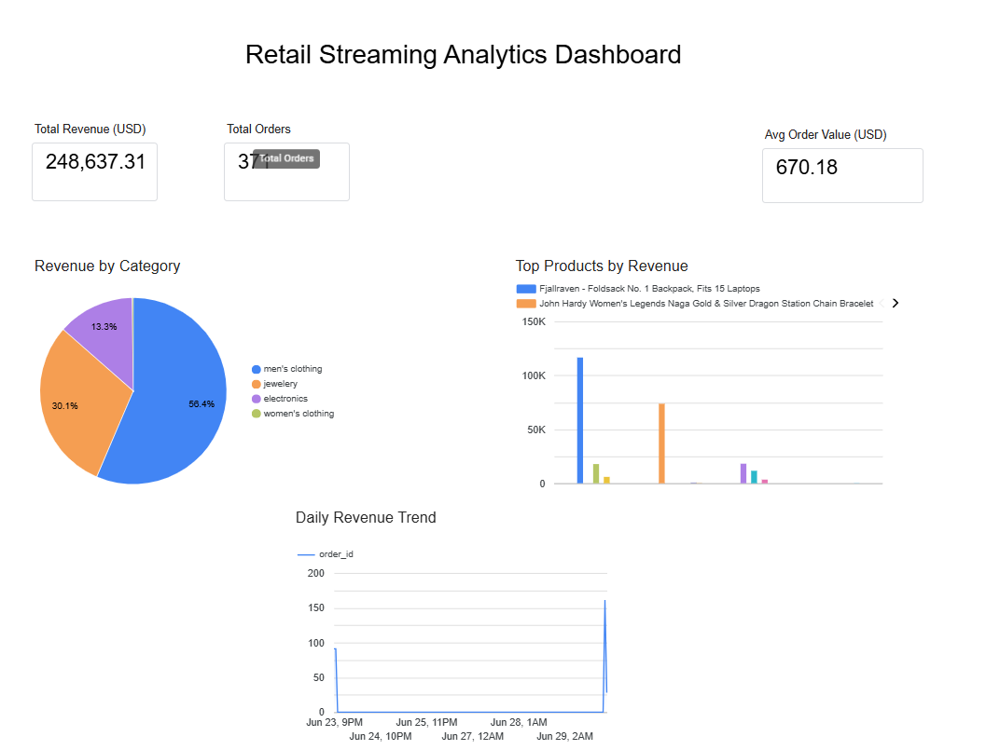
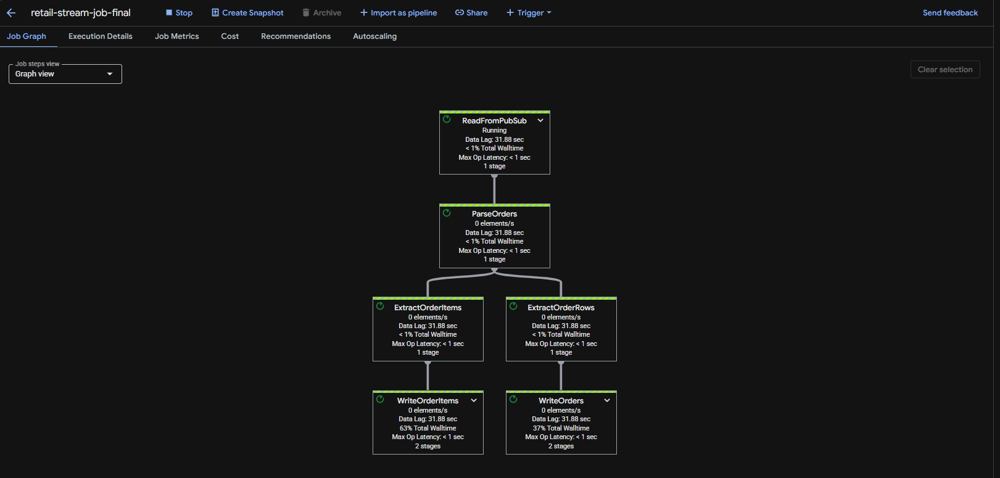

# Retail Streaming Analytics Pipeline

A real-time data engineering project built on Google Cloud Platform that ingests live e-commerce data, processes it through a streaming pipeline, models it using dbt, and visualizes KPIs in Looker Studio.

## Architecture

Fake Store API + Open Exchange Rates API
↓
Python Producer
↓
Google Cloud Pub/Sub
↓
Google Cloud Dataflow
(Apache Beam Streaming)
↓
BigQuery
(raw: orders, order_items)
↓
dbt Core
(staging → dimensions → facts → KPIs)
↓
Looker Studio Dashboard

## Tech Stack

| Layer | Technology |
|---|---|
| Data Source | Fake Store API, Open Exchange Rates API |
| Ingestion | Python, Google Cloud Pub/Sub |
| Processing | Apache Beam, Google Cloud Dataflow |
| Storage | Google BigQuery |
| Transformation | dbt Core |
| Visualization | Looker Studio |
| Orchestration | GitHub Actions (post-credits) |
| Version Control | Git, GitHub |

## Pipeline Overview

### 1. Producer (`scripts/producer.py`)
Pulls live product, user, and order data from Fake Store API every 60 seconds. Enriches each order with real-time USD to INR currency conversion using Open Exchange Rates API. Publishes events to Google Cloud Pub/Sub.

### 2. Dataflow Pipeline (`dataflow_jobs/stream_pipeline.py`)
Apache Beam streaming pipeline running on Google Cloud Dataflow. Reads messages from Pub/Sub, parses and transforms order events, and writes to two BigQuery tables — `orders` and `order_items`.

### 3. dbt Models (`retail_dbt/`)
dbt Core transforms raw BigQuery tables into a structured star schema:

staging/
stg_orders
stg_order_items
dimensions/
dim_customers
dim_products
facts/
fact_orders
kpis/
kpi_daily_revenue
kpi_top_products
kpi_category_revenue

### 4. Looker Studio Dashboard
Live dashboard connected to BigQuery showing:
- Total Revenue (USD)
- Total Orders
- Average Order Value
- Revenue by Category
- Top Products by Revenue
- Daily Revenue Trend

## Dashboard Preview



## Dataflow Job Execution



Pipeline executed on Google Cloud Dataflow with `DataflowRunner`, processing live order events from Pub/Sub with sub-second operation latency across all transformation stages.

## Project Setup

### Prerequisites
- Python 3.11.x
- Google Cloud SDK
- GCP project with Pub/Sub, Dataflow, BigQuery APIs enabled
- dbt Core (`pip install dbt-bigquery`)

### Installation

```bash
# Clone the repo
git clone https://github.com/TarunJaggarapu/retail-stream-pipeline.git
cd retail-stream-pipeline

# Create virtual environment
python -m venv venv
source venv/bin/activate  # Windows: venv\Scripts\activate

# Install dependencies
pip install -r requirements.txt
```

### Running the Pipeline

```bash
# Start the producer
python scripts/producer.py

# Deploy Dataflow job (separate terminal)
python dataflow_jobs/stream_pipeline.py

# Run dbt models
cd retail_dbt
dbt run
```

## Key Learnings
- Configured IAM roles for Dataflow service accounts including storage, BigQuery, and Pub/Sub permissions
- Handled GCP zone resource exhaustion by specifying machine type and alternate regions
- Designed a star schema using dbt with staging, dimension, fact, and KPI layers
- Built a real-time streaming pipeline with Apache Beam that writes to BigQuery using streaming inserts

## Author
Tarun Jaggarapu
[GitHub](https://github.com/TarunJaggarapu/retail-stream-pipeline)